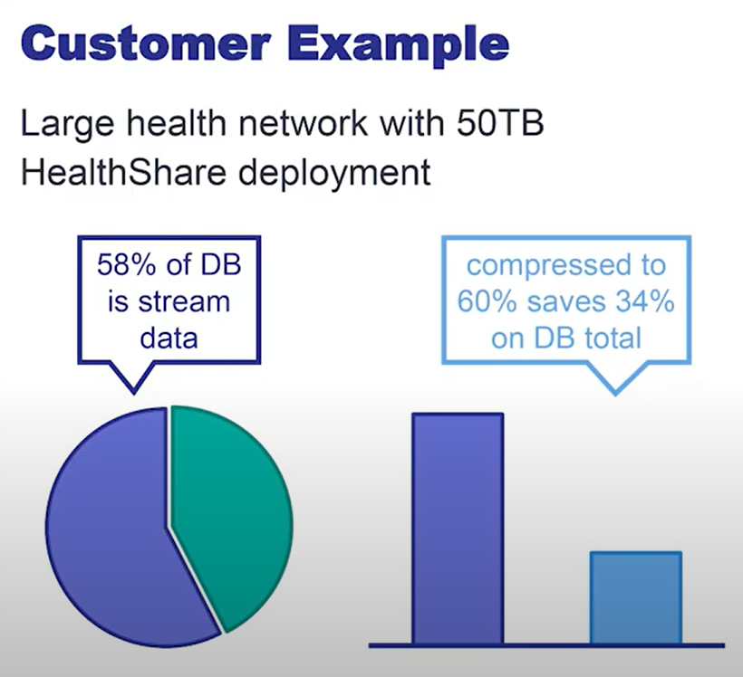
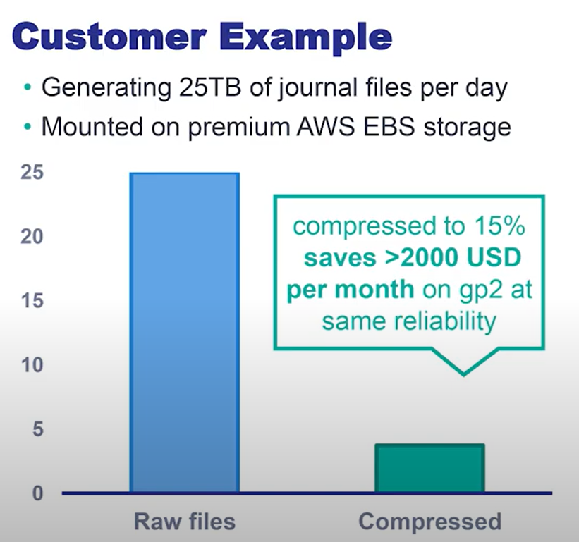

# 紹介ビデオ
米国本社プロダクトマネージャーによる本リリースのハイライトのご紹介ビデオ(英語)です。
https://www.intersystems.com/resources/whats-new-in-intersystems-iris-2022-1

# リリース内容

年一度のEMリリースです。
- メンテナンスアップデート提供:リリース日から2年間
- セキュリティアップデート提供:リリース日から4年間

- InterSystems IRIS, InterSystems IRIS for Health

- 同時期にリリースされるモジュール

	ICM, IKO, InterSyetms Reports, InterSystems Studio

- 独立してリリースされるモジュール

	IAM, SAM, 各種ドライバ類, VS Code ObjectScript 拡張

# プラットフォーム
|O/S|
|:---|
|Microsoft Windows Server 2012, Server 2016, Server 2019, Server ***2022***, 10, ***11*** for x86-64|
|Oracle Linux 7, 8 for x86–64|
|Red Hat Enterprise Linux 7.9 for x86-64|
|Red Hat Enterprise Linux 8.1–8.5 for x86-64 or ARM64|
|SUSE Linux Enterprise Server 15 SP3 for x86-64	|
|Ubuntu 18.04, 20.04 LTS for x86-64 or ARM64|
|IBM AIX® 7.2, 7.3 for Power System-64	|

|開発環境用O/S|
|:---|
|CentOS-7 x86-64|
|Apple macOS 10.15 for x86-64 AND ***M1***|

以下、2021.2,2022.1で追加された機能についてご紹介しています。

# 開発者向け

## Kafkaメッセージのサポート
Apache Kafka用のインバウンド・アウトバウンドアダプター、ビジネスサービス、ビジネスオペレーションおよび、低レベルなAPIを提供します。

これらを使用して、プロダクション環境、非プロダクション環境を問わず、kafkaの持つ、高速なデータパイプライン、ストリームに対する分析、データ投入などの機能を容易に利用できるようになります。

### プロダクション用途
インバウンドアダプタは、Kafkaのコンシューマ機能を提供します。

アウトバウンドアダプタは、Kafkaのプロデューサ機能を提供します。

### 低レベルなAPI

Kafkaのコンシューマ、プロデューサ機能を持つ、低レベルAPIを提供します。

```
Set settings = ##class(%External.Messaging.KafkaSettings).%New()
Set settings.username = "amandasmith"
Set settings.password = "234sdsge"
Set settings.servers = "100.0.70.179:9092, 100.0.70.089:7070"
Set settings.clientId = "BazcoApp"
Set client = ##class(%External.Messaging.Client).CreateClient(settings, .tSC)

Set topic = "quickstart-events"
Set value = "MyMessage", key = "OptionalTag"
Set msg = ##class(%External.Messaging.KafkaMessage).%New()
Set msg.topic = topic
Set msg.value = value
Set msg.key = key

Set tSC = client.SendMessage(msg)
```

> Kafkaとの接続に関して、開発者コミュニティに多数の寄稿がありますが、それらとは別にKafkaとの接続性を製品として提供するものになります。

## Python関連の強化

### 埋め込みPython
言語としてObjectScriptが使用できるあらゆる場面でPythonを使用可能になります。

使用例) [ePy.Test.cls](src/Sample/ePy/Test.cls)

> 実行環境としてのIRISとPythonは類似点が多く(インタプリタ、c言語実装、オブジェクトモデル)、同一プロセス空間で動作させるなど、他言語に比べて踏み込んだ統合を行っています。

Python Gateway(PEX)やPython SDKを置き換えるものではありません。

埋め込みPythonについては、開発者コミュニティに多数の寄稿がありますので、参照ください。

>6/28 (火) Embedded Pythonの新設トレーニングコースの[ご紹介ウェビナ](https://event.on24.com/wcc/r/3809492/8803F63076E114B9D660466D06F5E4A2)があります。

### Python SDK
既存のpyODBC,IRIS Native, Python Gwatewayに加えてDB-APIを追加。

> SQLAlchemy(PythonのORマッパー)を使用できるようにするための機能追加の一環です。

### プロダクション環境でのPython使用

プロダクションで多様なプログラム言語を使用可能にする機能であるPEXにPythonが追加されました。

> これで、サポートされる言語はPython, Java, .NET, ObjectScriptになりました。

> IRIS-Python間のAPIはIRIS Nativeを使用しています。***埋め込みPythonではありません。***


PEXとは、下記のようにJavaや.NETをプロダクションで使用するための機能です。これらが持つ多彩な外部接続ライブラリの使用に加え、ビジネスロジック(ビジネスプロセス)そのものをこれらの言語で記述することも可能です。


Pythonの機能を利用して、アダプタの作成、分析や演算を実施、永続メッセージの作成、長時間実行されるビジネスプロセスへの参加が可能となります。


## Visual Studio Code ObjectScript 拡張

### ドキュメントとの統合
該当箇所にマウスをかざすだけでドキュメントを表示。クラス階層のブラウジング。ユーザ作成のクラスドキュメントのプレビュー表示が可能になりました。

### シンタックスに埋め込みPythonサポート
埋め込みPythonのシンタックスカラーリングを正しく行います。

### Studioライクな使用方法の拡充
CSPファイルの編集・コンパイルが可能になりました。

サーバ側での検索が可能になりました。

> 現在サーバサイドの検索機能は、VSCODEのProposed APIを使用しているため、それらAPIが正式リリースになるまでは[こちらの手順](https://github.com/intersystems-community/vscode-objectscript#enable-proposed-apis)でプレビュー機能を有効化する必要があります。


### デバッグ機能
オブジェクトのプロパティ値を参照可能になりました。安定性をより向上しました。

## SQLクエリ実行のローコード化
外部データソースに対してSQLを実行するための、汎用のビジネスサービス、ビジネスオペレーションを用意しました。

>今まではSQLアダプタを使用するビジネスサービス、ビジネスオペレーションを作成する必要がありました。

受信したレコードの内容を保持するためのメッセージを個別に作成する必要はありません。レコードの内容はJSON形式でEns.StreamContainerに格納されます。

詳細は[こちら](https://docs.intersystems.com/iris20221/csp/docbook/Doc.View.cls?KEY=ESQL_bs)をご覧ください。

## .NET 5
ADO.NET, Native API, Gateway(PEX)において、.NET5をサポートします。

> .NET6は時期リリースでの対応に向けて準備中です。

# 実行速度、スケーラビリティ、セキュリティ関連
​
## アダプティブなSQLオプティマイザ

テーブルの統計情報をより軽量に取得する手段を実現することにより、高精度なランタイム時のクエリ選択が可能となりクエリパフォーマンスが向上しました。

下記は、パートナ様の実データと実際に使用されているクエリを使用したベンチマーク測定の結果です。2021.1-2022.1間で、I/O量が25%減、実行時間が半分に改善されている事がわかります。


### スマートサンプリング & テーブル統計の自動化
ブロックレベルでサンプリングを行うことで、今まで行単位で行っていたサンプリング(もしくはフルスキャン)による統計処理のコストを大幅に短縮しました。

クエリ初回実行時に統計情報が存在しない場合は、自動的に統計取得を行い、より良いクエリプランの選択を試みます。

今までは、統計処理の実行を忘れてしまったり、テーブルサイズが大きいため、プロダクション環境での実行をためらったりという事態が発生し、その結果、あまり効率的ではないクエリプランが使用され続ける可能性がありました。

従来のメカニズムと新しいメカニズムとの実行時間の比較は下記のようになります。


グラフ横軸は、テーブルサイズ0.000008GB(8KB)から22GBまでの自然対数ln(x)の値です。つまり  
ln(0.000008)=-11.736069016284 ～ ln(22)=3.0910424533583

> デフォルトのストレージマッピングの使用が前提になります。

[こちら](https://jp.community.intersystems.com/node/510751)に解説記事があります。

### ランタイムプランの選択

ランタイムプランの選択(Run-Time Plan Choice)をデフォルトで有効にしました。これにより、下記のようなクエリが高速化する可能性があります。

- 外れ値
```
....FROM log WHERE level='INFO'
```
特定の値がレコードの大半を占めるようなケース。

- 範囲指定
```
....FROM log WHERE dt > '5/5/22'
```
条件で指定した値(この場合は日付)が、logテーブル内で初期のものか、終盤のものかによって、対象レコード数が変動するケース。

- 常に真、偽になる条件
```
....FROM log WHERE (1=0 AND ...)
```
クエリツール、BIツールでよく見られるパターン。

[こちら](https://jp.community.intersystems.com/node/510746)に解説記事があります。


### 高度なテーブル統計

テーブル統計情報としてヒストグラムを取得するようになりました。これにより、レンジを指定するクエリに対しても選択性を計算できるようになりました。この結果をRTPCが使用することで、クエリの性能が向上する事が期待できます。

例えば、下記のようなクエリにおいて、LocationCountryに対してはRTPCの外れ値検知のメカニズムを使用可能ですが、EventDateに対しては個別の値の選択性はあまり役に立ちません。ヒストグラムを使用することで、レンジに対して、どの程度の選択性を持ちうるかを導出することが可能になりました。

```
SELECT * FROM Aviation.Event WHERE EventDate < '2004-05-01' AND LocationCountry = 'California'
```
.png)


[こちら](https://jp.community.intersystems.com/node/510611)に解説記事があります。

## ストレージ使用量の削減
ストリームおよびジャーナルを圧縮することにより、必要なストレージ使用量を大幅に削減しました。

> 特にクラウドでは重要な要素となります

### ストリームの圧縮について
グローバルベースのストリームを使用する際、デフォルトでその内容を圧縮します。既存の未圧縮状態のストリームは、次回の書き込み時に圧縮を行います。

実際の顧客データを使用した計測では、小～中サイズのテキストについては30～50%、XML/JSON形式のデータについては60～80%程度の削減効果が観測されました。




### ジャーナルの圧縮について
ジャーナルが切り替わった際に、非アクティブなジャーナルファイルを圧縮します。ロールバック、ロールフォワードは、圧縮済みのジャーナルファイルを使用します。

```
 C:\InterSystems\IRIS20221\mgr\journal のディレクトリ

2022/06/15  10:01    <DIR>          .
2022/06/15  10:01    <DIR>          ..
2022/06/13  10:00           425,984 20220612.002z
2022/06/13  14:40        92,446,720 20220613.001z
2022/06/14  09:55        13,811,712 20220613.002z
2022/06/15  10:01           155,648 20220614.001z
2022/06/15  10:01         1,048,576 20220615.001
2022/06/15  10:01                49 iris.lck
```

実際の顧客のケースでは、ジャーナルサイズが85%縮小され、信頼性を損なうことなく、EBSストレージ代金を2,000 USドル/月削減出来ました。


>ジャーナルファイルを(AWS S3のような)安価なストレージにアーカイブする機能は今後のリリースで提供予定です。

## オンラインでのShardのリバランス
Shardのリバランスをオンライン状態(ユーザがクエリ実行やデータの追加を継続)で実行できるように強化しました。その結果、Shardクラスタのデータノード追加をオンラインのまま実施出来るようになりました。今までは、一時的にクエリ、データ追加を保留する必要がありました。

>データノードの削除のオンライン化は今後のリリースにて対応予定です。

## TLS 1.3 Support
TLS1.3(OpenSSL 1.1.1)をサポートします。

> TLS1.3は、接続確立時のハンドシェークのやり取りを減らせるなど、より高速であることが知られています。

# 分析と機械学習関連

## SQLローダ
SQLテーブルへの新しいデータローディングの仕組みを提供するために、SQLにLOADコマンドを追加しました。

データソースとしてCSVもしくはJDBCを選択できます。
INSERT文によく似た構文でソースカラム、ターゲットカラムの調整を、IntegrgatedMLのUsingとよく似た構文で、動作の調整(デリミタの指定など)を行うことが出来ます。

```
LOAD DATA FROM FILE 'C://mydata/countries.csv'
COLUMNS (
    src_name VARCHAR(50),
    src_continent VARCHAR(30),
    src_region VARCHAR(30),
    src_surface_area INTEGER)
INTO Sample.Countries (Name,SurfaceArea,Region)
VALUES (src_name,src_surface_area,src_region)
USING {"from":{"file":{"columnseparator":";"}}}
```

```
LOAD DATA FROM JDBC CONNECTION MyJDBCConnection
TABLE countries
INTO Sample.Countries
```

紹介記事がありますのでご覧ください。

- [まったく新しい LOAD DATA コマンドのコツとヒント](https://jp.community.intersystems.com/node/516096)  
- [まったく新しい LOAD DATA コマンドのコツとヒント - パート II](https://jp.community.intersystems.com/node/516101)

## アダプティブアナリティクス
アダプティブアナリティクス(IRIS+AtScale)に以下の機能が追加されました。

1. アダプティブアナリティクスのクライアントとして、InterSystems Reportsが使用できるようになりました。これにより、PowerBIやTableauと同じデータモデルを使用してInterSystems Reportsを使用できるようになります。

2. InterSystems BI(DeepSee)のデータモデルを、アダプティブアナリティクスの定義としてインポートできるようになりました。

> キューブ間のRelationshipsやデータコネクタのような移行できない機能があります

InterSystems Reportsとは帳票作成エンジンであるZEN Report(既にオブソリート)の後継製品です。下記の紹介記事をご覧ください。

- [InterSystems Reportsでレポートを作成するのは難しいですか？](https://jp.community.intersystems.com/node/501576)  
- [コンテナで InterSystems Reports を動かしてみる](https://jp.community.intersystems.com/node/501656)

# クラウド、運用関連

## クラウドコネクタ
クラウド上でのIRISの管理を容易にするために、新たに下記のコネクタ(アダプタ)を提供いたします。

### オブジェクトストレージ

#### プロダクション用途

S3,Azure Blob, Google Cloud Storageの読み書きのためにインバウンド、アウトバウンドアダプタを提供します。

インバウンドアダプタは、指定したパターンに合致するオブジェクト(群)を取得し、ビジネスサービスのコールバック関数に、その内容をストリームとして提供します。  
アウトバウンドアダプタはUpload, Deleteを実行可能です。

> アダプタはJava PEXを使用して実装されています。

#### 低レベルなAPI

同等な機能を持つ、低レベルAPIを提供します。

```
Set bucketName = "my-bucket"
Set blobName = "test.txt"
// Cloud Storage Client作成 (クラウドプロバイダの種類は第3引数の内容で判断。この場合はAWS S3用)
Set myClient = ##class(%Net.Cloud.Storage.Client).CreateClient(,0,"C:\Users\irisowner\.aws\config", "ap-northeast-1", .tSC)

If myClient.BucketExists(bucketName){
	// S3にファイルをアップロード	
	Do myClient.UploadBlobFromFile(bucketName, blobName, "c:\temp\test.txt")

	// 指定バケット内のオブジェクトを列挙
	Set blobs=myClient.ListBlobs(bucketName)
	For i=1:1:blobs.Size {
		Set blob=blobs.GetAt(i)
		w blob.name," ",blob.size," ",blob.updateTime,!
	}
}

// clientをclose
Do myClient.Close()
```

詳細は[こちら](https://docs.intersystems.com/iris20221/csp/docbook/DocBook.UI.Page.cls?KEY=ECLOUD_intro)をご覧ください。

### Cloudwatch

Cloudwatchへの出力のための、アウトバウンドアダプタおよびビジネスオペレーションを提供します。下記のaws cliコマンドに相当します。

```
>aws cloudwatch put-metric-data --namespace MyNameSpace --metric-name TestMetric \ 
 --dimensions TestKey=TestValue --value 100
```

Cloudwatchアウトバウンドアダプタ[EnsLib.AmazonCloudWatch.OutboundAdapter](https://docs.intersystems.com/iris20221/csp/documatic/%25CSP.Documatic.cls?&LIBRARY=ENSLIB&CLASSNAME=EnsLib.AmazonCloudWatch.OutboundAdapter)はCloudwatchが公開しているPutMetricData APIを呼び出すために、下記のメソッドを提供しています。

```
Method PutMetricData(namespace As %String, metricName As %String,
					metricValue As %Numeric, metricUnit As %String,
					dims As %String = "") As %Status
```

ビジネスオペレーションは[EnsLib.AmazonCloudWatch.MetricDataOperation](https://docs.intersystems.com/iris20221/csp/documatic/%25CSP.Documatic.cls?&LIBRARY=ENSLIB&CLASSNAME=EnsLib.AmazonCloudWatch.MetricDataOperation)です。

詳細は[こちら](https://docs.intersystems.com/iris20221/csp/docbook/Doc.View.cls?KEY=AECW)をご覧ください。

> 2022.1ドキュメントより「現在使用できるのはPutMetricDataのみです。PutMetricAlarmは将来インターフェースが変更される可能性があります。」

### SNS(Amazon Simple Notification Service)

SNSへの出力のための、アウトバウンドアダプタおよびビジネスオペレーションを提供します。下記のaws cliコマンドに相当します。

```
aws sns publish --topic-arn arn:aws:sns:ap-northeast-1:[AWSアカウントID]:my_topic \
 --subject "Test mail" --message "Hello World"
```

SNSアウトバウンドアダプタ[EnsLib.AmazonSNS.OutboundAdapter](https://docs.intersystems.com/iris20221/csp/documatic/%25CSP.Documatic.cls?LIBRARY=ENSLIB&CLASSNAME=EnsLib.AmazonSNS.OutboundAdapter)はSNSが公開しているpublish APIを呼び出すために、下記のメソッドを提供しています

```
Set tSC = ..Adapter.Publish(..ARNTopic, request.Message, ..Subject)
```

ビジネスオペレーションは[EnsLib.AmazonSNS.BusinessOperation](https://docs.intersystems.com/iris20221/csp/documatic/%25CSP.Documatic.cls?&LIBRARY=ENSLIB&CLASSNAME=EnsLib.AmazonSNS.BusinessOperation)です。

詳細は[こちら](https://docs.intersystems.com/iris20221/csp/docbook/Doc.View.cls?KEY=EMESSAGE_sns)をご覧ください。
	
## IKO (InterSystems Kubernetes Operator)
IRISのKubernetesへのデプロイを容易にするために、新たに下記の機能を提供します。

IKOについては[こちら](https://jp.community.intersystems.com/node/499776)をご覧ください。

### SAMおよびIAM

SAM(InterSystems System Alert and Monitoring)およびIAM(InterSystems API Manager)をデプロイ、管理できます。IRISクラスタをスケールさせる(そしてそれらの監視を行う)ことが用意になります。

SAMに関しては、[こちら](https://jp.community.intersystems.com/node/498416)の記事を、IAMに関しては、[こちら](https://jp.community.intersystems.com/node/493416)の記事をごらんください。

### ロックダウンバージョンのIRISおよびWeb Gateway

[ロックダウンバージョン](https://docs.intersystems.com/iris20221/csp/docbook/DocBook.UI.Page.cls?KEY=ADOCK#ADOCK_iris_images_password_lockeddown)のIRISおよびWeb Gatewayをデプロイできます。Web GatewayはNginxもしくはApache版を選択可能です。

### 非永続ボリュームおよび永続ボリューム

非永続ボリューム、永続ボリュームいずれへのデプロイが可能です。

# その他
新しくなったTRACEユーティリティを提供します。

実行時のパフォーマンス分析ツールであるMONLBLやPERFMONは、データ取得時に出力(利用)目的を決めておく必要がありました。
TRACEは、ジェネリックなフォーマットでデータを蓄積することで、トレースしたイベントのナビゲーションやサマライズ等の分析操作を、より対話的に行えるようになりました。

サポートされるイベントタイプには、グローバルのSET/KILL、物理書き込み、ネットワーク超えの要求、キャッシュ、ジャーナルイベントなどが含まれます。

> イベントの収集ツールです。収集・蓄積にはオーバヘッドがかかります。蓄積されたデータをExcelなどで加工する必要があります。内容の解釈には専門知識と(公開されていない)ソースコードへのアクセスが必要になる事があるため、弊社のサポートの指導の元ご利用ください。

```
Reading TRACE file C:\InterSystems\IRIS20221\trace\iristrace_16816.txt
0.000000:      START
               STACK [ 0] X - @ +0
0.000185:      MemAlloc
0.000189:      CALL
               ARG [ 0] STR:app
0.000204:        MemAlloc
0.000225:        GloRef, ^rOBJ("app")
0.000243:        GloRef, ^rOBJ("app")
0.000260:        DirBlkBuf, ^rOBJ("app")
0.000273:        BpntBlkBuf, ^rOBJ("app")
0.000280:        DataBlkBuf, ^rOBJ("app")
0.001557:        RtnFetch
0.001569:        MemAlloc at ^app
0.001571:        RtnLoad ^app
0.001576:        RtnLine at +2^app
                 src:  Kill ^a
0.001582:        GloRef at +2^app, ^a
```

[APIを使用](src/test.mac)して独自出力を作成することも可能です。